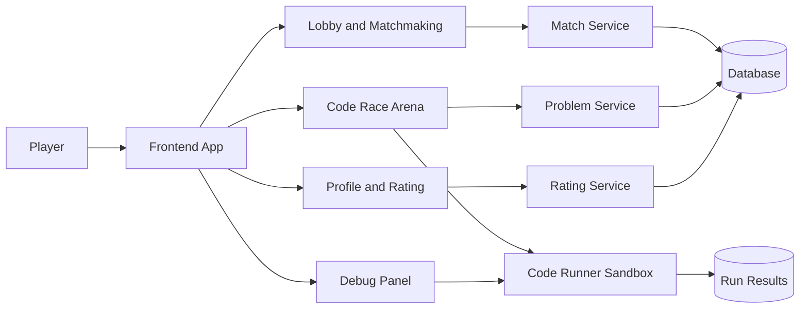
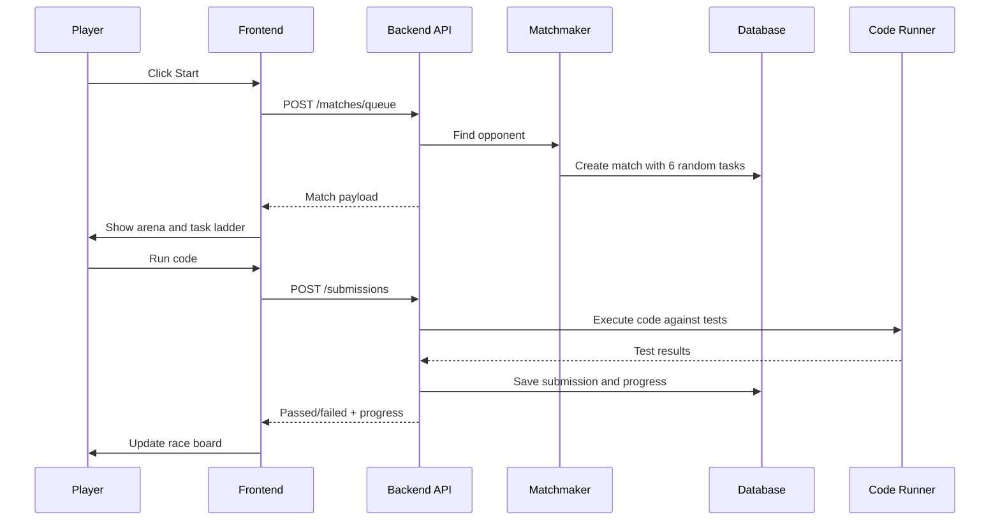

# Code Blitz Architecture

Code Blitz is planned as a competitive coding platform with a game lobby, ranked blitz matches, bots, ghost runs, a problem bank, code execution, debugging tools, rating, and match history.

## Product Modules



## Frontend

Current prototype:

- `index.html` holds the app screens: home, arena, problems, debug, profile.
- `styles.css` owns the chess.com-like dark game interface.
- `app.js` owns mock state, random match generation, task progress, opponent code preview, tests, timer, and mode switching.

Future frontend structure:

```text
frontend/
  src/
    app/
      routes/
      state/
      api/
    features/
      lobby/
      arena/
      problems/
      debugger/
      profile/
    shared/
      ui/
      editor/
      utils/
```

Main frontend responsibilities:

- render lobby and game modes;
- request a match from backend;
- show the current task set;
- send code runs/submissions;
- stream opponent progress;
- display debug output and test results.

## Backend

Recommended backend services:

```text
backend/
  app/
    main.py
    api/
      auth.py
      matchmaking.py
      matches.py
      problems.py
      submissions.py
      profile.py
    services/
      matchmaker.py
      task_picker.py
      rating.py
      code_runner.py
      bot_runner.py
    models/
      user.py
      problem.py
      match.py
      submission.py
    db/
      migrations/
```

Core backend responsibilities:

- keep problem bank and tags;
- create match task sets with rule `3 Easy + 2 Medium + 1 Hard`;
- match players by rating and queue;
- run code safely in a sandbox;
- compare outputs with hidden tests;
- save submissions and match timeline;
- update rating after match;
- support bot and ghost opponents.

## Database

The concrete PostgreSQL schema lives in `db/schema.sql`.

Core tables:

```text
users
  id, username, email, rating, created_at

problems
  id, title, difficulty, tags, statement, starter_code, time_limit_ms

test_cases
  id, problem_id, input_json, expected_json, is_hidden

matches
  id, mode, status, started_at, finished_at, winner_user_id

match_players
  match_id, user_id, side, rating_before, rating_after

match_tasks
  match_id, problem_id, position, difficulty

submissions
  id, match_id, user_id, problem_id, code, language, status, passed_count, runtime_ms

ghost_runs
  id, user_id, match_snapshot, total_time_ms, created_at
```

## Runtime Flow



## Near-Term Build Order

1. Keep the static prototype as the UI target.
2. Add a real frontend framework only when state becomes too complex.
3. Build a small backend API for problem bank and match creation.
4. Add sandboxed code execution.
5. Add WebSocket match progress.
6. Add auth, profiles, rating, and persistent history.
