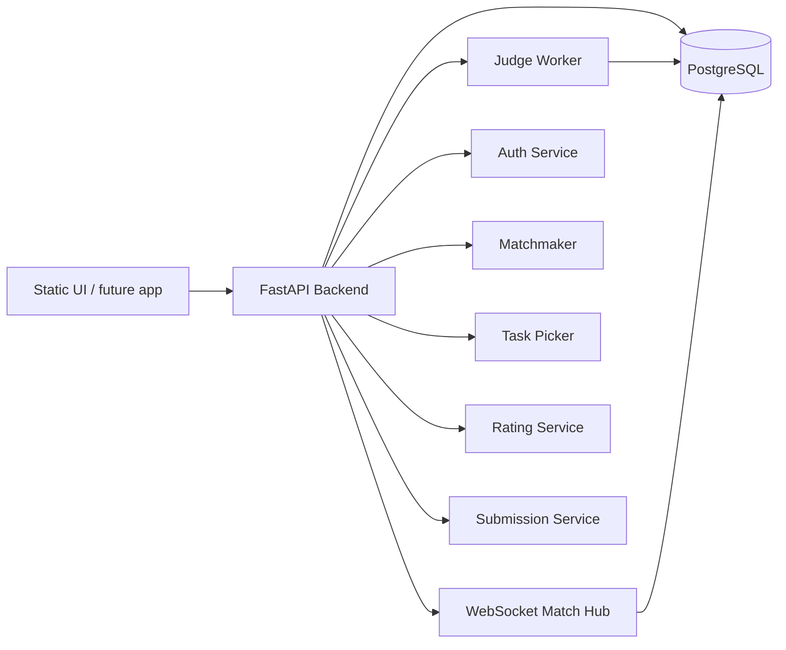
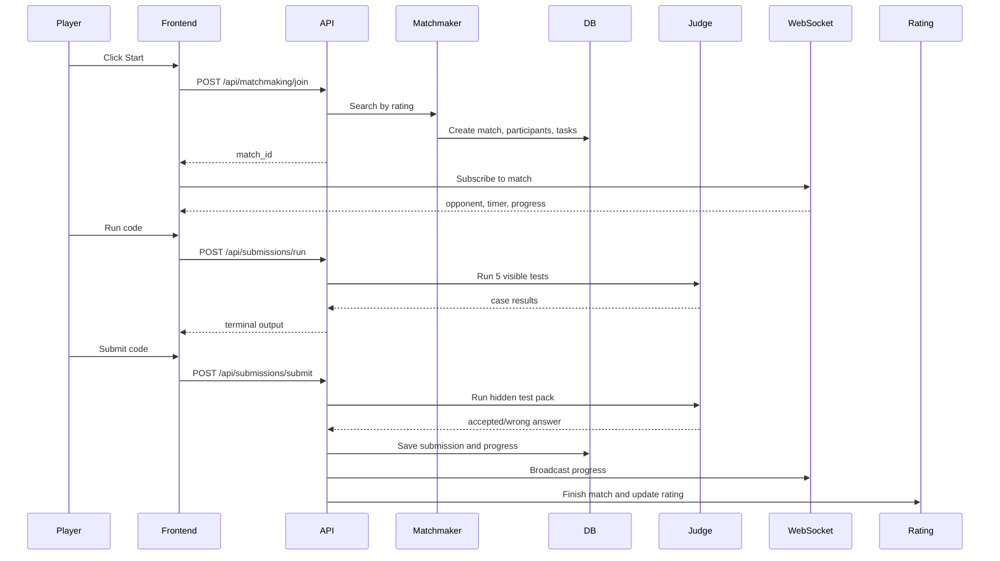

# Code Blitz Target Architecture

This document describes the backend and database direction for Code Blitz while keeping the current static frontend untouched as the visual target.

## Decision

The current frontend in `index.html`, `styles.css`, and `app.js` stays as the UI prototype. Backend work should grow beside it, then connect screen by screen through API calls.

The backend should become the source of truth for:

- auth and user profile;
- rating and match history;
- problem bank and hidden tests;
- online matchmaking;
- match state and opponent progress;
- code runs and final submissions.

## High-Level Shape



## Backend Modules

Recommended structure:

```text
backend/
  app/
    main.py
    api/
      auth.py
      profile.py
      problems.py
      matchmaking.py
      matches.py
      submissions.py
      leaderboard.py
    services/
      auth_service.py
      task_picker.py
      matchmaker.py
      match_state.py
      judge.py
      rating.py
    models/
      users.py
      problems.py
      matches.py
      submissions.py
      rating.py
    db/
      migrations/
      seed.py
```

## Match Flow



## API Contract

Auth:

- `POST /api/auth/register`
- `POST /api/auth/login`
- `GET /api/auth/me`
- later: `POST /api/auth/oauth/google`
- later: `POST /api/auth/oauth/github`

Problems:

- `GET /api/problems`
- `GET /api/problems/{slug}`
- `POST /api/admin/problems`
- `POST /api/admin/problems/{id}/test-cases`

Matchmaking:

- `POST /api/matchmaking/join`
- `POST /api/matchmaking/cancel`
- `GET /api/matchmaking/status`

Matches:

- `GET /api/matches/{id}`
- `GET /api/matches/{id}/tasks`
- `GET /api/matches/{id}/events`
- `WS /api/matches/{id}/stream`

Submissions:

- `POST /api/submissions/run` checks 5 visible tests.
- `POST /api/submissions/submit` checks the full hidden pack.

Rating:

- `GET /api/leaderboard`
- `GET /api/profile/{username}`

## Problem Picker

Ranked online match:

```text
duration: 30 minutes
tasks: 6
layout: easy, easy, medium, easy, medium, hard
```

Rules:

- pick by layout difficulty;
- avoid duplicate `concept_group` when possible;
- avoid problems solved by either player in recent matches;
- prefer active problems with high `speed_score`;
- save the chosen order in `match_tasks` so both players get the same set.

## Judge Model

`Run`:

- uses visible/sample tests only;
- should not update match progress;
- saves optional lightweight submission record for debugging.

`Submit`:

- uses hidden tests;
- updates `match_participants.progress_percent`;
- emits a `match_events` row;
- broadcasts progress through WebSocket;
- advances the frontend to the next task only when accepted.

## Rating Model

Use Elo-like rating:

```text
new user rating: 1200
K factor: 32
minimum rating: 100
```

Winner:

1. more accepted tasks;
2. if equal, faster total accepted time;
3. if still equal, draw.

Save every update in `rating_events`; never only overwrite `users.rating`.

## Build Order

1. Keep the current frontend frozen.
2. Add database schema v2 and seed problem import.
3. Align FastAPI models with schema v2.
4. Implement auth with real database users.
5. Implement problem list and match task picker.
6. Implement `run` and `submit` endpoints.
7. Implement matchmaking queue by rating.
8. Add WebSocket progress.
9. Connect the existing frontend to API step by step.

